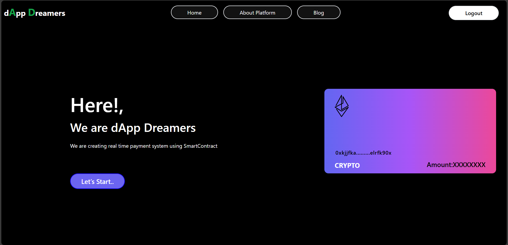
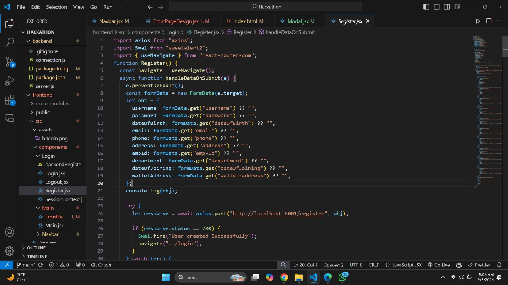
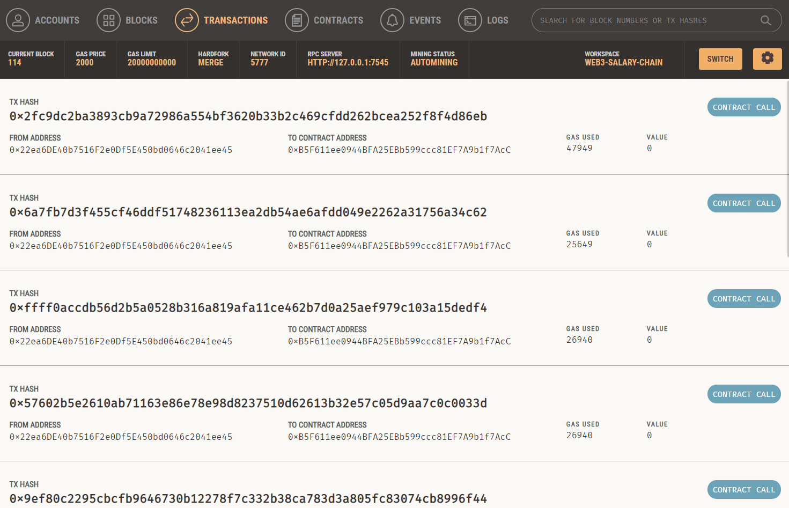
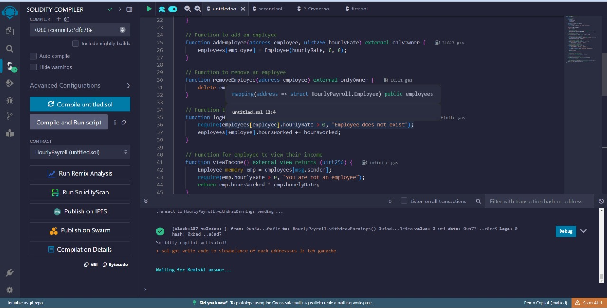

# dApps Dreamers - Web 3.0 based realtime salary website
<a href="">
</img>
</a>

#### Creating a platform where money and value move more freely.

## Problem statement

Companies struggle with traditional payroll systems that delay employee compensation until the end of the month, impacting employee satisfaction and financial stability. To modernize payroll, there is a need for a decentralized, real-time solution that enables companies to automatically pay all employees on an hourly basis, providing immediate and transparent compensation, reducing financial stress, and improving overall workforce morale.

## Introduction
This repository contains the code for a web application that enables employees to receive their salaries in real-time using Web3 technology.

### Web3 Integration:
- Smart contracts: The application uses smart contracts for secure and transparent transactions.
- Real-time transactions: Employees receive their salaries in real-time using Web3 technology.

## Frameworks used:

- MERN: (MongoDB, Express.js, React.js, and Node.js) is used on this website to make it seamless and more interactive.

<a href="">
</img>
</a>

- Ganache: for testing the web3 integration locally.

<a href="">
</img>
</a>

- Solidity: smart contracts.

<a href="">
</img>
</a>

- Remix IDE: efficiently develop, test, and deploy smart contracts, ensuring a smooth and reliable blockchain integration.

- TailwindCSS: highly responsive and customizable designs, enabling a faster and more consistent user interface development.

## Contributing

Contributions are welcome! If you have any suggestions, please open an issue or submit a pull request.

## License

This project is licensed under the [MIT License](LICENSE).